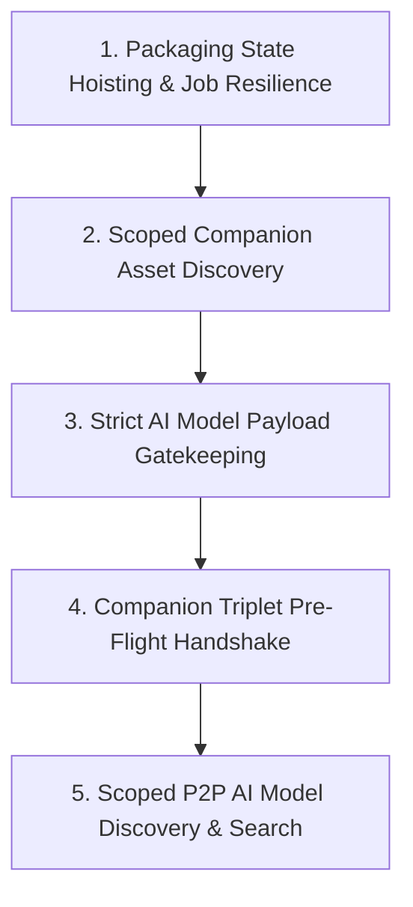

# RenegadeSwarm Engineering Roadmap

> Architectural vision, technical priorities, and milestone roadmap for the decentralized AI model distribution network.

---

## 🎯 Guiding Principles

1. **AI-First & Protocol-Enforced**: RenegadeSwarm is purpose-built for AI model weights, checkpoints, LoRAs, VAEs, GGUFs, and embedded generation workflows. Generic, non-AI binary payloads are strictly rejected at the protocol layer.
2. **Cryptographic Provenance & Web of Trust (WoT)**: Every model manifest carries Ed25519 creator signatures and integrity checksums verified against local keyrings.
3. **Resilient User Experience**: Long-running background operations (hashing, piece streaming, packaging, syncing) must survive UI state transitions and application restarts.
4. **Metadata-First Pre-Flight Verification**: Always harvest and verify lightweight metadata and cryptographic hashes before downloading multi-gigabyte tensor weight blocks.

---

## 🗺️ Core Roadmap Milestones

---

### Milestone 1: Packaging State Hoisting & Job Resilience

#### 📌 Problem Statement
When a user prepares a model package in the **Package & Seed** view, enters metadata, and triggers hash calculation and manifest generation, navigating to another tab (e.g., *Dashboard* or *Bandwidth*) unmounts the React view. This unmounting wipes the form inputs and progress indicators from the UI even though the background IPC worker is still actively computing the SHA-256 hash and assembling the manifest.

#### 🛠️ Architectural Plan
- **Hoist Packaging State**: Move packaging job states (`idle`, `hashing`, `generating_manifest`, `seeding`, `completed`, `error`) out of the local React component state (`SeederView.tsx`) and into a persistent app store / main process service.
- **Main Process Job Manager**:
  - Implement a `PackageJobManager` in `src/main/engine/packageJobManager.ts` that tracks active packaging tasks by file path and job ID.
  - Stream progress events over IPC (`swarm:packageProgress`, `swarm:packageComplete`).
- **Resilient UI Binding**:
  - On mount, `SeederView` requests active job states via `window.renegadeSwarm.getActivePackagingJob()`.
  - Seamlessly re-attaches progress bars, hash logs, and form fields when switching tabs.

---

### Milestone 2: Scoped Companion Asset Harvesting & Local Directory Tree Discovery

#### 📌 Problem Statement
Swarm's companion asset scanner previously probed generic OS picture directories instead of scoping strictly to the model's actual parent directory and configured AI workspace roots (e.g., ComfyUI `models/` or WebUI `embeddings/`). This caused companion images (`<model>.png`, `<model>.preview.png`) to be missed during packaging.

#### 🛠️ Architectural Plan
- **Direct Sibling Harvesting**:
  - Enforce companion discovery strictly in the model's directory tree:
    - `<model_base_name>.sha256`
    - `<model_base_name>.civitai.info` / `<model_base_name>.huggingface.info` / `<model_base_name>.info`
    - `<model_base_name>.png` / `<model_base_name>.jpg` / `<model_base_name>.webp` / `<model_base_name>.preview.png`
- **ComfyUI & CMM Workspace Awareness**:
  - Query configured model roots from the RenegadeCMM SQLite bridge.
  - Automatically match preview assets stored alongside checkpoints and LoRAs.
- **Embedded Workflow Metadata**:
  - Inspect companion images for embedded ComfyUI/A1111 prompt workflows (`tEXtparameters`, `tEXtworkflow`) and surface them during packaging.

---

### Milestone 3: Strict AI Model Payload Enforcement (Add Magnet Gatekeeping)

#### 📌 Problem Statement
Preventing RenegadeSwarm from being misused as a generic P2P downloader for non-AI content (such as pirated software or arbitrary binaries) requires proactive payload validation prior to allocating disk space.

#### 🛠️ Architectural Plan
- **Manifest File Inspector**:
  - Parse incoming torrent metadata and manifest files before starting multi-part file allocation.
  - Validate all declared files against allowed AI extensions:
    - **Tensors**: `.safetensors`, `.gguf`, `.bin`, `.pt`, `.pth`, `.onnx`
    - **Configs**: `.json`, `.yaml`, `.info`, `.sha256`
    - **Previews**: `.png`, `.jpg`, `.jpeg`, `.webp`, `.mp4`, `.webm`
- **Magic Byte Enforcement**:
  - Prohibit executable signatures (`MZ`, `ELF`, `Mach-O`), generic archives (`RAR`, `7z`), and shell scripts (`#!`).
  - Reject non-compliant torrents immediately with clear UI feedback.

---

### Milestone 4: Scoped P2P AI Model Discovery & Curated Search

#### 📌 Problem Statement
Currently, Swarm relies on manually pasting Magnet URIs. Adding open-ended torrent indexing would expose users to generic junk. A dedicated search feature must remain strictly locked to open-weight AI models with clear provenance signaling.

#### 🛠️ Architectural Plan
- **Scoped Model Discovery Engine**:
  - Query DHT and swarm nodes for certified `SwarmManifest` announcements tagged with model metadata (base model, creator, type, tags).
  - Filter out any announcement lacking a valid AI manifest payload.
- **Metadata Verification & Trust Scoring**:
  - Verify presence of companion JSON and SHA-256 checksums on all search results.
  - Cross-reference creator signatures against the local Web of Trust (WoT) keyring.
- **Amber Warning System for Raw / Unverified Checkpoints**:
  - Display green shield badges for verified, signed models with full companion data.
  - Display a prominent **Amber Warning Panel** when a user attempts to fetch an unverified or raw checkpoint with missing metadata, requiring explicit user confirmation before download.

---

### Milestone 5: Companion File Triplet Pre-Flight Handshake

#### 📌 Problem Statement
Downloading large models (2GB to 50GB+) before verifying file integrity or creator metadata wastes bandwidth and storage if the file is mismatched or tampered with.

#### 🛠️ Architectural Plan
- **Pre-Flight Triplet Negotiation**:
  - Fetch the companion triplet first:
    1. `<base>.sha256`: Expected plaintext SHA-256 checksum.
    2. `<base>.info`: Structured creator, base model, license, and version metadata.
    3. `<base>.<ext>`: Preview image asset.
- **Pre-Download Verifier**:
  - Verify against CivitAI (`/api/v1/model-versions/by-hash/:hash`) or Hugging Face APIs.
  - For unindexed or custom models (fine-tunes, custom LoRAs), execute local Ed25519 signature checks and Web of Trust scoring.
- **Atomic Quarantine & Promotion**:
  - Download weights to isolated `.part` staging files in Quarantine.
  - Compute full SHA-256 on completion; atomically promote to library only when checksum and format validation pass.

---

## 📊 Milestone Execution & Status Matrix

| Milestone | Focus Area | Status | Target Version |
| :--- | :--- | :---: | :---: |
| **Milestone 1** | Packaging State Hoisting & Background Job Persistence | 🔄 In Design | v0.3.0 |
| **Milestone 2** | Scoped Companion Asset Harvesting & Workflow Discovery | ✅ Implemented | v0.2.0 |
| **Milestone 3** | Strict AI Model Payload Gatekeeping & Magic Byte Rejection | ✅ Implemented | v0.2.0 |
| **Milestone 4** | Scoped P2P AI Model Discovery & Amber Unverified Warning | 📅 Scheduled | v0.3.0 |
| **Milestone 5** | Companion Triplet Pre-Flight Handshake & Quarantine Verification | ✅ Implemented | v0.2.0 |

---

## 💖 Backing & GitHub Sponsorship

Accelerating these milestones and maintaining robust P2P testing infrastructure is made possible by community support. If you want to support development, consider becoming a sponsor:

- **Official Sponsor Page**: [github.com/sponsors/DevNullInc](https://github.com/sponsors/DevNullInc)

---

## 🔗 Related Documentation
- [ARCHITECTURE.md](docs/ARCHITECTURE.md) — System architecture and P2P engine overview.
- [WEB_OF_TRUST.md](docs/WEB_OF_TRUST.md) — Web of Trust cryptographic specification and keyring management.
- [MANIFEST_SPEC.md](docs/MANIFEST_SPEC.md) — Swarm manifest schema and canonical JSON structure.
- [CHANGELOG.md](CHANGELOG.md) — Version release notes and migration history.
