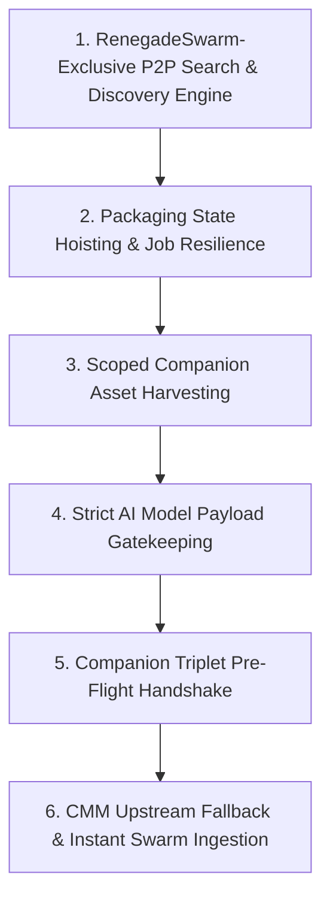

# RenegadeSwarm Engineering Roadmap

> Architectural vision, technical priorities, and milestone roadmap for the decentralized AI model distribution network.

---

## Guiding Principles

1. **AI-First & Protocol-Enforced**: RenegadeSwarm is purpose-built exclusively for AI model weights, checkpoints, LoRAs, VAEs, GGUFs, and embedded generation workflows. Generic, non-AI binary payloads (movies, pirated software, arbitrary archives) are strictly rejected at the protocol layer.
2. **RenegadeSwarm-Exclusive P2P Discovery**: Search queries communicate only with verified live instances of RenegadeSwarm, filtering out generic BitTorrent traffic through application-specific handshakes and signed metadata broadcasts.
3. **Cryptographic Provenance & Web of Trust (WoT)**: Every model manifest carries Ed25519 creator signatures and integrity checksums verified against local keyrings.
4. **Resilient User Experience**: Long-running background operations (hashing, piece streaming, packaging, syncing) must survive UI state transitions and application restarts.
5. **Metadata-First Pre-Flight Verification**: Always harvest and verify lightweight metadata and cryptographic hashes before downloading multi-gigabyte tensor weight blocks.

---

## Core Roadmap Milestones

---

### Milestone 1: RenegadeSwarm-Exclusive P2P Search & Discovery Engine (First Priority)

#### Problem Statement
Currently, finding models on RenegadeSwarm requires users to manually copy and paste Magnet URIs from external web pages. However, enabling open-ended torrent crawling or DHT scraping would open the floodgates to non-AI garbage, pirated movies, and malicious software. Swarm needs an in-app, decentralized model search engine that is strictly isolated from standard BitTorrent noise.

#### Architectural Plan
- **Filter Standard BitTorrent Traffic**:
  - The search subsystem completely ignores standard public BitTorrent swarm announces and tracker scrapings.
  - Search queries and broadcast announces operate exclusively across **live instances of RenegadeSwarm**.
- **Application-Specific BEP 10 Extension Handshake (`RS_MODEL_DISCOVERY_V1`)**:
  - Peers identify themselves during the BitTorrent extension handshake (BEP 10) by broadcasting custom capability dictionaries (`renegade_swarm_version`, `model_catalog_digest`).
  - Only peers that complete the certified RenegadeSwarm handshake participate in search routing.
- **Signed Manifest & Metadata Broadcasts**:
  - Model seeding nodes announce cryptographically signed model catalog summaries (`SwarmManifest` summaries containing model title, base model, model type, creator Ed25519 key, and SHA-256 hash).
  - Search hits are verified against local CMM format schemas before appearing in the search results UI.
- **Amber Warning System for Raw / Unverified Checkpoints**:
  - **Verified Shield**: Displayed when search results contain valid companion JSON, known creator Ed25519 signatures, and verified SHA-256 hashes.
  - **Amber Warning Panel**: If a user selects a community or unverified raw model lacking companion metadata, Swarm displays a prominent Amber Warning dialog detailing the missing provenance and requires explicit user confirmation before initiating the pre-download handshake.

---

### Milestone 2: Packaging State Hoisting & Job Resilience

#### Problem Statement
When a user prepares a model package in the **Package & Seed** view, enters metadata, and triggers hash calculation and manifest generation, navigating to another tab (e.g., *Dashboard* or *Bandwidth*) unmounts the React view. This unmounting wipes the form inputs and progress indicators from the UI even though the background IPC worker is still actively computing the SHA-256 hash and assembling the manifest.

#### Architectural Plan
- **Hoist Packaging State**: Move packaging job states (`idle`, `hashing`, `generating_manifest`, `seeding`, `completed`, `error`) out of the local React component state (`SeederView.tsx`) and into a persistent app store / main process service.
- **Main Process Job Manager**:
  - Implement a `PackageJobManager` in `src/main/engine/packageJobManager.ts` that tracks active packaging tasks by file path and job ID.
  - Stream progress events over IPC (`swarm:packageProgress`, `swarm:packageComplete`).
- **Resilient UI Binding**:
  - On mount, `SeederView` requests active job states via `window.renegadeSwarm.getActivePackagingJob()`.
  - Seamlessly re-attaches progress bars, hash logs, and form fields when switching tabs.

---

### Milestone 3: Scoped Companion Asset Harvesting & Local Directory Tree Discovery

#### Problem Statement
Swarm's companion asset scanner previously probed generic OS picture directories instead of scoping strictly to the model's actual parent directory and configured AI workspace roots (e.g., ComfyUI `models/` or WebUI `embeddings/`). This caused companion images (`<model>.png`, `<model>.preview.png`) to be missed during packaging.

#### Architectural Plan
- **Direct Sibling Harvesting**:
  - Enforce companion discovery strictly in the model's directory tree:
    - `<model_base_name>.sha256`
    - `<model_base_name>.civitai.info` / `<model_base_name>.huggingface.info` / `<model_base_name>.info`
    - `<model_base_name>.png` / `<model_base_name>.jpg` / `<model_base_name>.webp` / `<model_base_name>.preview.png`
- **ComfyUI & CMM Workspace Awareness**:
  - Query configured model roots from the RenegadeCMM SQLite bridge.
  - Automatically match preview assets stored alongside checkpoints and LoRAs.
- **Embedded Workflow Metadata**:
  - Inspect companion images for embedded ComfyUI/A1111 prompt workflows (`tEXtparameters`, `tEXtworkflow`) and surface them during packaging.

---

### Milestone 4: Strict AI Model Payload Enforcement (Add Magnet Gatekeeping)

#### Problem Statement
Preventing RenegadeSwarm from being misused as a generic P2P downloader for non-AI content (such as pirated software or arbitrary binaries) requires proactive payload validation prior to allocating disk space.

#### Architectural Plan
- **Manifest File Inspector**:
  - Parse incoming torrent metadata and manifest files before starting multi-part file allocation.
  - Validate all declared files against allowed AI extensions:
    - **Tensors**: `.safetensors`, `.gguf`, `.bin`, `.pt`, `.pth`, `.onnx`
    - **Configs**: `.json`, `.yaml`, `.info`, `.sha256`
    - **Previews**: `.png`, `.jpg`, `.jpeg`, `.webp`, `.mp4`, `.webm`
- **Magic Byte Enforcement**:
  - Prohibit executable signatures (`MZ`, `ELF`, `Mach-O`), generic archives (`RAR`, `7z`), and shell scripts (`#!`).
  - Reject non-compliant torrents immediately with clear UI feedback.

---

### Milestone 5: Companion File Triplet Pre-Flight Handshake

#### Problem Statement
Downloading large models (2GB to 50GB+) before verifying file integrity or creator metadata wastes bandwidth and storage if the file is mismatched or tampered with.

#### Architectural Plan
- **Pre-Flight Triplet Negotiation**:
  - Fetch the companion triplet first:
    1. `<base>.sha256`: Expected plaintext SHA-256 checksum.
    2. `<base>.info`: Structured creator, base model, license, and version metadata.
    3. `<base>.<ext>`: Preview image asset.
- **Pre-Download Verifier**:
  - Verify against CivitAI (`/api/v1/model-versions/by-hash/:hash`) or Hugging Face APIs.
  - For unindexed or custom models (fine-tunes, custom LoRAs), execute local Ed25519 signature checks and Web of Trust scoring.
- **Atomic Quarantine & Promotion**:
  - Download weights to isolated `.part` staging files in Quarantine.
  - Compute full SHA-256 on completion; atomically promote to library only when checksum and format validation pass.

---

### Milestone 6: RenegadeCMM Upstream Fallback & Instant Swarm Ingestion (Hugging Face / Civitai)

#### Problem Statement
When a requested AI model or checkpoint is not present or has zero active seeders on the decentralized RenegadeSwarm mesh, discovery reaches a dead end. Users must manually locate external links, manage external HTTP downloads, verify file hashes, and manually package the model before it can be used locally or shared to the swarm.

#### Architectural Plan
- **Automated Fallback Trigger via CMM Bridge**:
  - When RenegadeCMM is loaded and a requested model cannot be resolved within the active RenegadeSwarm peer mesh, CMM automatically triggers an external upstream search.
  - Queries Civitai (`/api/v1/model-versions/by-hash/:hash`, `/api/v1/models`) and Hugging Face (`/api/models/:model_id`) endpoints to locate authoritative model weights and canonical companion metadata.
- **Multi-Part Download & Continuous Integrity Verification**:
  - Initiates segmented chunk downloads using HTTP Range requests into staging `.part` buffers.
  - Performs streaming SHA-256 checksum calculations and header inspections (SafeTensors metadata validation, magic byte checks) on incoming chunks before writing to disk.
- **Instant Swarm Seeding Handshake**:
  - Once download and integrity verification complete, CMM notifies RenegadeSwarm via the `CmmDbBridge` and IPC interface.
  - Generates the canonical `SwarmManifest` and companion triplet (`.sha256`, `.info`, preview image) locally.
  - Automatically registers the model in Swarm's piece engine and announces the new infoHash to the RenegadeSwarm P2P mesh—immediately seeding the freshly acquired model to the network without requiring manual packaging steps.

---

## Milestone Execution & Status Matrix

| Milestone | Priority | Focus Area | Status | Target Version |
| :--- | :---: | :--- | :---: | :---: |
| **Milestone 1** | **P1 (Top)** | RenegadeSwarm-Exclusive P2P Model Search & Discovery | ✅ Implemented | v0.3.0 |
| **Milestone 2** | **P2** | Packaging State Hoisting & Background Job Persistence | ✅ Implemented | v0.3.0 |
| **Milestone 3** | **P3** | Scoped Companion Asset Harvesting & Workflow Discovery | ✅ Implemented | v0.2.0 |
| **Milestone 4** | **P4** | Strict AI Model Payload Gatekeeping & Magic Byte Rejection | ✅ Implemented | v0.2.0 |
| **Milestone 5** | **P5** | Companion Triplet Pre-Flight Handshake & Quarantine Verification | ✅ Implemented | v0.2.0 |
| **Milestone 6** | **P2** | RenegadeCMM Upstream Fallback (Hugging Face / Civitai) & Instant Seeding | 🔄 In Design | v0.3.0 |

---

## Backing & GitHub Sponsorship

Accelerating these milestones and maintaining robust P2P testing infrastructure is made possible by community support. If you want to support development, consider becoming a sponsor:

- **GitHub Sponsors**: [github.com/sponsors/DevNullInc](https://github.com/sponsors/DevNullInc)
- **Ko-fi**: [ko-fi.com/stygianrenegade](https://ko-fi.com/stygianrenegade)
- **PayPal**: [Direct Donation](https://www.paypal.com/ncp/payment/ME25M8VZRNSEN)

---

## Related Documentation
- [ARCHITECTURE.md](docs/ARCHITECTURE.md) — System architecture and P2P engine overview.
- [WEB_OF_TRUST.md](docs/WEB_OF_TRUST.md) — Web of Trust cryptographic specification and keyring management.
- [MANIFEST_SPEC.md](docs/MANIFEST_SPEC.md) — Swarm manifest schema and canonical JSON structure.
- [CHANGELOG.md](CHANGELOG.md) — Version release notes and migration history.
