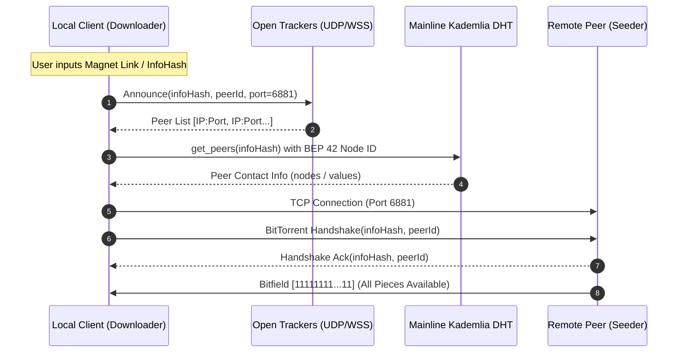
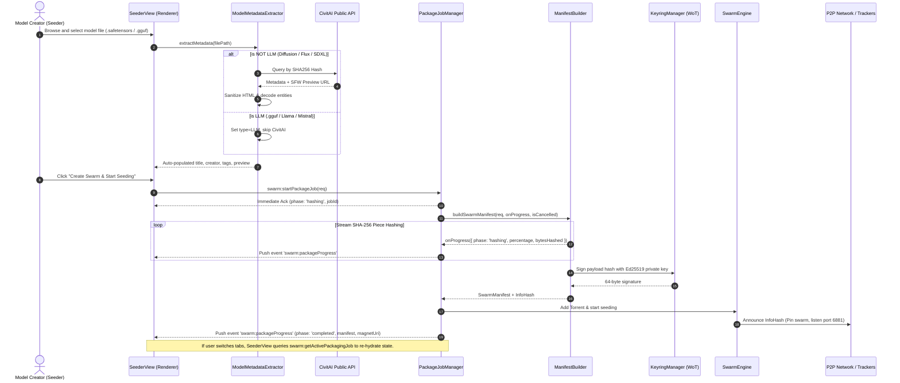
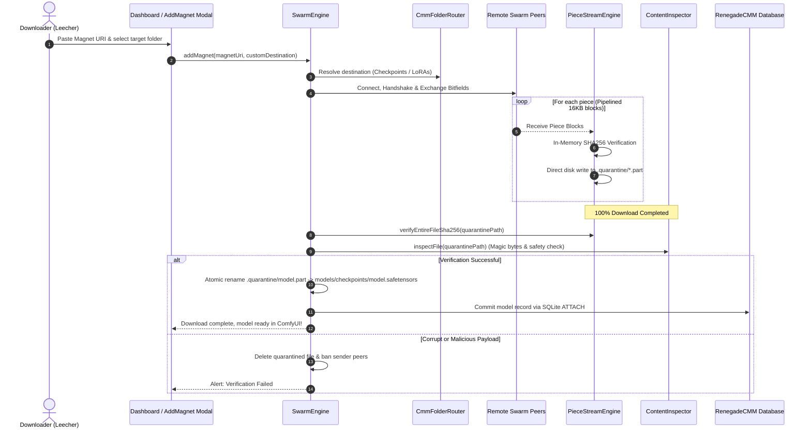

# RenegadeSwarm System Architecture & P2P Protocol Specification

> **Comprehensive Technical Architecture Guide**: This document details the internal design, peer-to-peer wire protocol, discovery mechanisms, cryptographic verification pipeline, and data flows of **RenegadeSwarm**, explaining exactly how nodes connect, communicate, and distribute multi-gigabyte AI models across the decentralized network.

---

## Table of Contents

1. [High-Level Architecture Overview](#1-high-level-architecture-overview)
2. [Process & Boundary Isolation Model](#2-process--boundary-isolation-model)
3. [Peer-to-Peer (P2P) Communication Architecture](#3-peer-to-peer-p2p-communication-architecture)
   - [3.1 Peer Discovery: Trackers, DHT, and PEX](#31-peer-discovery-trackers-dht-and-pex)
   - [3.2 Swarm Manifests & InfoHash Generation](#32-swarm-manifests--infohash-generation)
   - [3.3 The BitTorrent Wire Protocol Implementation](#33-the-bittorrent-wire-protocol-implementation)
   - [3.4 Piece Pipelining & Random-Access Streaming](#34-piece-pipelining--random-access-streaming)
   - [3.5 Tit-for-Tat Choking & Optimistic Unchoking](#35-tit-for-tat-choking--optimistic-unchoking)
   - [3.6 RenegadeSwarm-Exclusive P2P Discovery Protocol](#36-renegadeswarm-exclusive-p2p-discovery-protocol)
4. [End-to-End Operational Lifecycle Flows](#4-end-to-end-operational-lifecycle-flows)
   - [Flow A: Creating, Signing & Seeding a Model](#flow-a-creating-signing--seeding-a-model)
   - [Flow B: Discovering, Downloading, Verifying & Ingesting](#flow-b-discovering-downloading-verifying--ingesting)
5. [RenegadeCMM Live Database & Multi-Folder Bridge](#5-renegadecmm-live-database--multi-folder-bridge)
6. [Cryptographic Provenance & Web of Trust (WoT)](#6-cryptographic-provenance--web-of-trust-wot)
7. [Zero-Trust Security & Quarantine Pipeline](#7-zero-trust-security--quarantine-pipeline)
8. [Codebase Component Map](#8-codebase-component-map)

---

## 1. High-Level Architecture Overview

RenegadeSwarm is structured as a layered, modular desktop application composed of a sandboxed presentation layer, an Electron main process orchestration engine, a high-performance BitTorrent wire protocol layer, and an atomic integration bridge with **RenegadeCMM**:

```
┌────────────────────────────────────────────────────────────────────────────────────────┐
│                                 RENDERER PROCESS (UI)                                  │
│             React 19 + TypeScript + Vite + Glassmorphic Responsive Layout              │
│       [DashboardView]   [CmmSyncView]   [SeederView]   [SettingsView]   [Bandwidth]    │
└───────────────────────────────────────────┬────────────────────────────────────────────┘
                                            │ ContextBridge (Preload API)
                                            │ Strict Zod-Validated IPC
                                            ▼
┌────────────────────────────────────────────────────────────────────────────────────────┐
│                               ELECTRON MAIN PROCESS ENGINE                             │
│ ┌────────────────────────────────────────────────────────────────────────────────────┐ │
│ │                                   SwarmEngine                                      │ │
│ │   • Swarm state management      • Torrent lifecycle      • Auto-rate orchestration │ │
│ └──────────────────────────────────────┬─────────────────────────────────────────────┘ │
│                                        │                                               │
│    ┌───────────────────────────────────┼───────────────────────────────────┐           │
│    ▼                                   ▼                                   ▼           │
│ ┌──────────────────────┐   ┌──────────────────────┐   ┌──────────────────────────────┐ │
│ │  PackageJobManager   │   │  DiscoveryEngine     │   │ PreDownloadVerifier          │ │
│ │  • Async background  │   │  • BEP 10 discovery  │   │ • CivitAI / HF validation    │ │
│ │  • Progress stream   │   │  • P2P search fanout │   │ • Custom WoT signature check │ │
│ │  • Tab re-hydration  │   │  • WoT trust scoring │   │ • Sibling asset harvester    │ │
│ └──────────────────────┘   └──────────────────────┘   └──────────────────────────────┘ │
│    ┌───────────────────────────────────┼───────────────────────────────────┐           │
│    ▼                                   ▼                                   ▼           │
│ ┌──────────────────────┐   ┌──────────────────────┐   ┌──────────────────────────────┐ │
│ │  DaemonRpcEngine     │   │ PieceStreamEngine    │   │ ContentValidator / Inspector │ │
│ │  • JSON-RPC sidecar  │   │ • 16KB sub-blocks    │   │ • Magic-byte validation      │ │
│ │  • Transmission/rqbit│   │ • Direct disk writes │   │ • Anti-polyglot/executable   │ │
│ │  • CSRF token retry  │   │ • In-memory SHA256   │   │ • Strict quarantine pipeline │ │
│ └──────────────────────┘   └──────────────────────┘   └──────────────────────────────┘ │
│    ┌───────────────────────────────────┼───────────────────────────────────┐           │
│    ▼                                   ▼                                   ▼           │
│ ┌──────────────────────┐   ┌──────────────────────┐   ┌──────────────────────────────┐ │
│ │ DhtHardeningManager  │   │ KeyringManager (WoT) │   │ CmmDbBridge & FolderRouter   │ │
│ │ • BEP 42 Node IDs    │   │ • Ed25519 keypairs   │   │ • SQLite ATTACH DATABASE     │ │
│ │ • Rate-limit query   │   │ • AES-256-GCM vault  │   │ • Multi-directory routing    │ │
│ │ • Swarm pinning      │   │ • 15-min lockout     │   │ • Model metadata sync        │ │
│ └──────────────────────┘   └──────────────────────┘   └──────────────────────────────┘ │
└───────────────────────────────────────────┬────────────────────────────────────────────┘
                                            │ Local JSON-RPC / TCP / UDP (Port 6881)
                                            ▼
┌────────────────────────────────────────────────────────────────────────────────────────┐
│                              DECENTRALIZED P2P NETWORK                                 │
│        [BitTorrent Trackers]     [Mainline Kademlia DHT]     [Connected Peers]         │
└────────────────────────────────────────────────────────────────────────────────────────┘
```

---

## 2. Process & Boundary Isolation Model

RenegadeSwarm adheres to a strict multi-process security boundary architecture:

1. **Sandboxed Renderer (`dist/renderer/`)**:
   - Executed inside a fully isolated Chromium Webview with `contextIsolation: true`, `nodeIntegration: false`, and `sandbox: true`.
   - Cannot access Node.js filesystem APIs, native child processes, raw sockets, or operating system handles.
2. **Preload Context Bridge (`src/main/preload.ts`)**:
   - Exposes a minimal, typed, read-only interface `window.renegadeSwarm` to the browser environment.
   - All renderer requests pass through asynchronous IPC invocations (`ipcRenderer.invoke`).
3. **Main Process IPC Gatekeeper (`src/main/ipcHandlers.ts`)**:
   - Every IPC handler parses incoming parameters with runtime **Zod schemas** (`src/shared/ipcContracts.ts`).
   - Rejects unauthorized, malformed, or malicious payloads before delegating to internal engine modules.

---

## 3. Peer-to-Peer (P2P) Communication Architecture

RenegadeSwarm uses the standard BitTorrent P2P protocol, customized with AI-specific metadata manifests, cryptographic signing, and multi-gigabyte random-access piece streaming.

### 3.1 Peer Discovery: Trackers, DHT, and PEX

When a user adds a model via a Magnet link (e.g., `magnet:?xt=urn:btih:3c4d...&dn=ModelName`), the client discovers other peers hosting that model through three complementary channels:



1. **Public & Private Trackers**:
   - Announces to default robust UDP and WebSocket trackers (`udp://tracker.opentrackr.org:1337/announce`, `wss://tracker.webtorrent.dev`).
2. **Hardened Mainline Kademlia DHT (`src/main/engine/dhtHardening.ts`)**:
   - **BEP 42 Security Compliance**: Enforces IP-derived node IDs to neutralize Sybil and eclipse attacks on routing tables.
   - **Query Rate Limiting**: Caps background maintenance bandwidth to `< 5 KB/s` to prevent background network congestion.
   - **Pinned Swarms**: Strictly restricts DHT peer lookups to explicitly active or seeded swarms.
3. **Peer Exchange (PEX)**:
   - Connected peers periodically share lists of other peers participating in the same infohash swarm.

---

### 3.2 Swarm Manifests & InfoHash Generation

Every model distributed on RenegadeSwarm is defined by an immutable JSON **Swarm Manifest** (`src/protocol/types.ts`):

```json
{
  "swarmSpecVersion": "1.0.0",
  "manifestId": "6f9a8d2e-4b1c-43f1-8f2e-9d8a7c6b5e4f",
  "createdAt": 1773428900000,
  "createdBy": "RenegadeSwarm/0.1.0",
  "pieceLength": 8388608,
  "totalSizeBytes": 2384729104,
  "model": {
    "title": "Flux.1 Dev Hyper Realism",
    "version": "2.1.0",
    "modelType": "Checkpoint",
    "baseModel": "Flux.1 D",
    "creator": "TheStygianRenegade",
    "creatorPublicKey": "70fb7e8a57bbec5ffba1d16e317fb915ddeead2a5f3d8853ffb21759155936b7",
    "nsfw": false,
    "tags": ["flux", "photorealism", "portrait"]
  },
  "hashes": {
    "sha256": "e3b0c44298fc1c149afbf4c8996fb92427ae41e4649b934ca495991b7852b855",
    "infoHash": "9b1d8f2e4c7a5b3d2e1f0a8c9b7d6e5f4a3b2c1d"
  },
  "files": [
    {
      "relativePath": "flux1-dev-hyper-realism.safetensors",
      "canonicalFileName": "flux1_dev_hyper_realism_thestygianrenegade.safetensors",
      "sizeBytes": 2384729104,
      "fileType": "Model",
      "targetSubfolder": "checkpoints"
    }
  ],
  "signature": {
    "algorithm": "ed25519",
    "publicKey": "70fb7e8a57bbec5ffba1d16e317fb915ddeead2a5f3d8853ffb21759155936b7",
    "signature": "8a7b6c5d4e...",
    "signedPayloadHash": "e3b0c44..."
  }
}
```

- **InfoHash**: Computed as the 20-byte SHA-1 digest of the canonical bencoded info dictionary (or canonical manifest header).
- **Piece Length**: Dynamically optimized based on total file size (from **256 KB** for small LoRAs up to **32 MB** for 40GB+ LLM checkpoints) to keep piece hashes and network overhead negligible.

---

### 3.3 The BitTorrent Wire Protocol Implementation

Peers communicate over standard TCP sockets (default port **6881**) using binary framing defined in [`src/protocol/wireProtocol.ts`](file:///d:/gitprojects/RenegadeSwarm/src/protocol/wireProtocol.ts):

#### 1. The 68-Byte Binary Handshake
Every P2P connection begins with an exact 68-byte handshake packet:

```
 0                   1                   2                   3
 0 1 2 3 4 5 6 7 8 9 0 1 2 3 4 5 6 7 8 9 0 1 2 3 4 5 6 7 8 9 0 1
+-+-+-+-+-+-+-+-+-+-+-+-+-+-+-+-+-+-+-+-+-+-+-+-+-+-+-+-+-+-+-+-+
| pstrlen (19)  | "BitTorrent protocol" (19 bytes)              |
+-+-+-+-+-+-+-+-+-+-+-+-+-+-+-+-+-+-+-+-+-+-+-+-+-+-+-+-+-+-+-+-+
| ... (protocol string continued)                               |
+-+-+-+-+-+-+-+-+-+-+-+-+-+-+-+-+-+-+-+-+-+-+-+-+-+-+-+-+-+-+-+-+
| Extension Bits (8 bytes, BEP 10 enabled at byte index 25)     |
+-+-+-+-+-+-+-+-+-+-+-+-+-+-+-+-+-+-+-+-+-+-+-+-+-+-+-+-+-+-+-+-+
| 20-byte info_hash (target model identifier)                   |
+-+-+-+-+-+-+-+-+-+-+-+-+-+-+-+-+-+-+-+-+-+-+-+-+-+-+-+-+-+-+-+-+
| 20-byte peer_id (client instance unique token)                |
+-+-+-+-+-+-+-+-+-+-+-+-+-+-+-+-+-+-+-+-+-+-+-+-+-+-+-+-+-+-+-+-+
```

#### 2. Standard Wire Protocol Message Types
All subsequent messages are framed with a 4-byte big-endian length prefix followed by a 1-byte Message ID:

| ID | Name | Payload | Function |
|---|---|---|---|
| `0` | **Choke** | *None* | Informs peer that no piece requests will be serviced. |
| `1` | **Unchoke** | *None* | Informs peer they are allowed to request piece blocks. |
| `2` | **Interested** | *None* | Announces that the local client wants pieces held by the peer. |
| `3` | **NotInterested** | *None* | Announces that the peer has no pieces needed by the client. |
| `4` | **Have** | `uint32 pieceIndex` | Broadcasts that a new piece has completed and verified. |
| `5` | **Bitfield** | `byte[] bitfield` | Sent immediately after handshake to indicate piece availability. |
| `6` | **Request** | `uint32 index`, `uint32 begin`, `uint32 length` | Requests a 16KB sub-block of a specific piece. |
| `7` | **Piece** | `uint32 index`, `uint32 begin`, `byte[] block` | Delivers the 16KB raw binary block payload. |
| `8` | **Cancel** | `uint32 index`, `uint32 begin`, `uint32 length` | Cancels a pending block request. |
| `20` | **Extended** | `uint8 extId`, `bencoded payload` | BEP 10 metadata exchange (exchanging JSON swarm manifests). |

---

### 3.4 Piece Pipelining & Random-Access Streaming

To saturate high-speed fiber connections and handle 20GB+ models without memory exhaustion, [`PieceStreamEngine`](file:///d:/gitprojects/RenegadeSwarm/src/main/engine/pieceStreamEngine.ts) implements random-access streaming:

1. **16KB Sub-Block Pipelining**:
   - Each Piece (e.g., 8MB) is divided into 512 sub-blocks of 16,384 bytes (`BLOCK_SIZE = 16384`).
   - The client pipelines up to 16 outstanding block requests simultaneously per peer to eliminate round-trip latency stalls.
2. **Pre-Write In-Memory Piece SHA256 Verification**:
   - As blocks arrive, they assemble in an in-memory piece buffer.
   - Once all blocks for Piece `#N` are received, the piece's SHA256 is computed and validated against the manifest hash table before touching persistent storage.
   - **Poisoning Defense**: If a piece fails SHA256 verification, it is discarded in memory. Bad peers are choked and penalised; disk files are never contaminated.
3. **Direct File-Descriptor Offset Writes**:
   - Validated pieces are written directly to disk via `fs.write(fd, pieceData, offset)` at `pieceIndex * pieceLength`.
   - Requires zero contiguous memory allocation for the entire model file.

---

### 3.5 Tit-for-Tat Choking & Optimistic Unchoking

[`PeerManager`](file:///d:/gitprojects/RenegadeSwarm/src/main/engine/peerManager.ts) dynamically balances upload and download bandwidth across connected peers using a game-theoretic **Tit-for-Tat** choking algorithm:

1. **Regular Unchoke Rounds (Every 10 seconds)**:
   - Evaluates all interested peers based on their rolling 20-second download speed.
   - Unchokes the top **4 fastest uploaders** (Upload Slots), providing reciprocal high-speed seeding.
2. **Optimistic Unchoke Rounds (Every 30 seconds)**:
   - Randomly unchokes 1 additional interested peer regardless of current transfer speed.
   - Allows newly joined peers to obtain their first pieces and discovers potentially faster connections.

---

### 3.6 RenegadeSwarm-Exclusive P2P Discovery Protocol

To provide native, decentralized model search without scraping open BitTorrent DHT swarms or admitting non-AI torrent noise, RenegadeSwarm implements an application-specific extension protocol over **BEP 10 Extended Messaging**:

```
┌──────────────────────────────────────────────────────────────────────────────────┐
│                   BEP 10 EXTENDED DISCOVERY HANDSHAKE                            │
│  • Extension ID: 1 (renegade_swarm_discovery_v1)                                 │
│  • Client ID: RenegadeSwarm/0.3.0                                                │
│  • Capability Flags: discovery, metadata_sync, wot_attestation                   │
└────────────────────────────────────────┬─────────────────────────────────────────┘
                                         │
                                         ▼
┌──────────────────────────────────────────────────────────────────────────────────┐
│                   STRUCTURED DISCOVERY QUERY ENVELOPE                            │
│  • Query ID (UUIDv4)           • Keyword tokens                                  │
│  • Category filters (LoRA/GGUF) • Max results (1-50)                              │
│  • Ed25519 Query Signature     • Timestamp (TTL expiration)                      │
└────────────────────────────────────────┬─────────────────────────────────────────┘
                                         │
                                         ▼
┌──────────────────────────────────────────────────────────────────────────────────┐
│                   DISCOVERY ENGINE & WEB OF TRUST SCORING                        │
│  • Local Catalog Indexing      • Response Deduplication                          │
│  • Query Broadcast to Peers    • TTL Result Caching                              │
│  • KeyringManager Evaluation   • Trust Level Badging (Verified/Community/Amber)  │
└──────────────────────────────────────────────────────────────────────────────────┘
```

1. **BEP 10 Extended Handshake Negotiation (`renegade_swarm_discovery_v1`)**:
   - During peer connection establishment, nodes exchange extended dictionaries mapping extension names to local message IDs.
   - Only peers that advertise `renegade_swarm_discovery_v1` participate in discovery query routing, ensuring search queries stay 100% within certified RenegadeSwarm nodes while leaving underlying BitTorrent data piece distribution completely open.
2. **Signed Discovery Queries & Responses (`src/protocol/discoveryTypes.ts`)**:
   - Queries contain search terms, optional model category filters (Checkpoints, LoRAs, GGUF/LLM, VAEs, ControlNets), minimum trust score filters, and cryptographic nonces.
   - Responses return full manifest digests: title, model type, base model, creator name, Ed25519 public key, SHA-256 hash, info_hash, file sizes, and preview asset URLs.
3. **Discovery Engine Lifecycle (`src/main/engine/discoveryEngine.ts`)**:
   - **Local Catalog Indexing**: Ingests models from active seeders and local CMM SQLite catalogs.
   - **Multi-Peer Query Fan-Out**: Broadcasts debounced search queries across all connected extension-capable peers.
   - **Deduplication & TTL Caching**: Aggregates responses by SHA-256 hash and caches query results with a 5-minute TTL.
   - **Web of Trust Evaluation**: Automatically scores each search hit against `KeyringManager`, assigning trust scores (100 = Root/Pinned VerifiedCreator, 60 = Community TOFU, 20 = Untrusted, 0 = Blocked).
4. **Amber Warning System Integration**:
   - The UI displays an Amber Warning safeguard dialog when users select unverified or community models lacking verified signatures, requiring explicit acknowledgement of security disclosures before triggering downloads.

---

## 4. End-to-End Operational Lifecycle Flows

### Flow A: Creating, Signing & Seeding a Model



---

### Flow B: Discovering, Downloading, Verifying & Ingesting



---

## 5. RenegadeCMM Live Database & Multi-Folder Bridge

RenegadeSwarm is designed to integrate natively with **RenegadeCMM** without running intermediate HTTP microservices or duplicate index databases:

```
┌──────────────────────────────────────────────────────────────────────────────┐
│                           SQLite ATTACH ARCHITECTURE                         │
│                                                                              │
│   ┌───────────────────────────────┐      ┌───────────────────────────────┐   │
│   │     renegadeswarm.sqlite      │      │     renegadecmm.sqlite        │   │
│   │  (Active Swarm Transfers,     │ ATTACH (Discovered ComfyUI Models,   │   │
│   │   App Settings, Bandwidth)    │ ───►  Local Model Hashes, Config)    │   │
│   └───────────────────────────────┘      └───────────────────────────────┘   │
└──────────────────────────────────────────────────────────────────────────────┘
```

1. **Atomic Dual-Database Querying**:
   - The client runs `ATTACH DATABASE 'D:/gitprojects/RenegadeCMM/renegadecmm.sqlite' AS cmm;`.
   - Queries model hashes and ComfyUI directory configurations with sub-millisecond local SQLite joins.
2. **Multi-Folder Routing (`src/main/cmm/cmmFolderRouter.ts`)**:
   - Detects all folders defined in CMM's `app_config` (`comfyui_folders`, `comfyui_root`, `folder_mappings`).
   - Routes incoming files automatically to canonical subdirectories based on model type:
     - Checkpoints / Models $\rightarrow$ `checkpoints/`
     - LoRAs $\rightarrow$ `loras/`
     - UNet Weights $\rightarrow$ `unet/`
     - VAE Models $\rightarrow$ `vae/`
     - Text Encoders / CLIP $\rightarrow$ `text_encoders/`
     - ControlNet $\rightarrow$ `controlnet/`
     - Upscalers $\rightarrow$ `upscale_models/`
3. **Canonical Filename Enforcement**:
   - Standardizes filenames to prevent collisions:
     $$\text{formatCmmCanonicalFileName}(\text{title}, \text{creator}, \text{ext}) \Longrightarrow \text{title\_creator.ext}$$

---

## 6. Cryptographic Provenance & Web of Trust (WoT)

Every swarm manifest includes an **Ed25519 digital signature** guaranteeing creator attribution:

1. **Key Generation & Machine Vault Isolation**:
   - Keys are generated via Node.js standard cryptographic curve Ed25519.
   - Private keys are stored securely using machine-bound hardware encryption (Electron native OS `safeStorage` via Windows DPAPI, macOS Keychain / Secure Enclave, Linux Secret Service) in the Main process and are never exposed across renderer IPC or network bridges.
   - **Machine-Bound Anti-Spoofing**: Sealing the vault to the local machine fingerprint prevents key cloning across devices, ensuring malicious actors cannot forge creator identities or sign malicious payloads.
   - **Anti-Abuse Cooldown**: Enforces a 24-hour regeneration lockout to stop disposable spam identities.
2. **Trust Tiers**:
   - `VerifiedCreator`: Direct key verification against personal or curated keys (e.g., default verified creator `70fb7e8a57bbec5ffba1d16e317fb915ddeead2a5f3d8853ffb21759155936b7`).
   - `Community`: Known creator in the local keyring with positive endorsements.
   - `Untrusted`: Unrecognized public key. Model can still download, but requires manual confirmation.
   - `Blocked`: Blacklisted key. Swarms signed by this identity are dropped automatically.

---

## 7. Zero-Trust Security & Quarantine Pipeline

Before any file is promoted into your active ComfyUI library, it must pass 4 consecutive security barriers:

```
[In-Memory SHA256 per Piece]
       │ (Pass)
       ▼
[.quarantine/*.part Staging on Disk]
       │ (Pass 100% Download)
       ▼
[Full-File Streaming SHA256 Verification]
       │ (Pass)
       ▼
[Multi-Pass Magic-Byte & Anti-Executable Inspection]
       │ (SafeTensors / GGUF Validated)
       ▼
[Atomic Promotion to ComfyUI Directory & CMM Commit]
```

- **Prohibited Signatures**: Instantly rejects files containing Windows PE headers (`MZ`), Linux ELF (`\x7fELF`), Mach-O binaries, ZIP archive headers (`PK\x03\x04`), or shell scripts (`#!`).
- **SafeTensors Header Validation**: Reads the 8-byte uint64 header size, validates JSON schema bounds (<25MB), and verifies that tensor offsets align with overall file size.

### PyTorch Pickle Execution Risk vs SafeTensors Zero-Trust

> [!WARNING]
> **PyTorch Weights (.pt / .bin / .ckpt) Pickle Risk**: Legacy PyTorch checkpoints rely on Python `pickle` serialization. When loaded in Python or ComfyUI environments via `torch.load()`, malicious code embedded in the pickle opcode stream can execute arbitrary system commands.
> 
> * **Zero-Trust Formats**: **SafeTensors (`.safetensors`)** and **GGUF (`.gguf`)** are strictly structured data files containing tensor arrays and JSON/binary headers with **no executable bytecode capability**.
> * **RenegadeCMM Built-in Model Conversion Tools**: For legacy PyTorch models, [**RenegadeCMM**](https://github.com/DevNullInc/RenegadeCMM) features built-in conversion utilities to safely transform `.pt` and `.bin` weights into zero-trust SafeTensors format. See the [**RenegadeCMM Features Documentation**](https://github.com/DevNullInc/RenegadeCMM/blob/main/docs/FEATURES.md) for full instructions.

---

## 8. Codebase Component Map

| Path | Primary Responsibility |
|---|---|
| [`src/main/engine/swarmEngine.ts`](file:///d:/gitprojects/RenegadeSwarm/src/main/engine/swarmEngine.ts) | Central swarm orchestrator; manages active downloads, seeding, and bandwidth loop. |
| [`src/main/engine/daemonRpcEngine.ts`](file:///d:/gitprojects/RenegadeSwarm/src/main/engine/daemonRpcEngine.ts) | JSON-RPC client for local BitTorrent daemon (Transmission / rqbit sidecar) with CSRF 409 session handshake negotiation. |
| [`src/main/engine/packageJobManager.ts`](file:///d:/gitprojects/RenegadeSwarm/src/main/engine/packageJobManager.ts) | Persistent background packaging job manager with phase state machine, chunk progress streaming, and tab-switching persistence. |
| [`src/main/engine/discoveryEngine.ts`](file:///d:/gitprojects/RenegadeSwarm/src/main/engine/discoveryEngine.ts) | BEP 10 P2P model discovery aggregator, peer query broadcaster, and Web of Trust scorer. |
| [`src/main/engine/preDownloadVerifier.ts`](file:///d:/gitprojects/RenegadeSwarm/src/main/engine/preDownloadVerifier.ts) | Multi-registry hash verifier (CivitAI, HuggingFace) and custom model Ed25519 signature validator. |
| [`src/main/engine/peerManager.ts`](file:///d:/gitprojects/RenegadeSwarm/src/main/engine/peerManager.ts) | Manages TCP connections to peers, Bitfields, and Tit-for-Tat choking/unchoking. |
| [`src/main/engine/pieceStreamEngine.ts`](file:///d:/gitprojects/RenegadeSwarm/src/main/engine/pieceStreamEngine.ts) | Random-access file descriptor writes and in-memory piece SHA256 validation. |
| [`src/main/engine/dhtHardening.ts`](file:///d:/gitprojects/RenegadeSwarm/src/main/engine/dhtHardening.ts) | BEP 42 Sybil protection, query rate-limiting (<5KB/s), and pinned swarm tracking. |
| [`src/main/engine/keyringManager.ts`](file:///d:/gitprojects/RenegadeSwarm/src/main/engine/keyringManager.ts) | Ed25519 identity generation, 15-minute anti-abuse lockout, and keyring storage. |
| [`src/main/engine/sharingPolicyManager.ts`](file:///d:/gitprojects/RenegadeSwarm/src/main/engine/sharingPolicyManager.ts) | Evaluates Opt-In model sharing rules, NSFW policies, and path exclusion filters. |
| [`src/main/cmm/cmmDbBridge.ts`](file:///d:/gitprojects/RenegadeSwarm/src/main/cmm/cmmDbBridge.ts) | SQLite `ATTACH DATABASE` bridge with `renegadecmm.sqlite` for direct local model sync. |
| [`src/main/cmm/cmmFolderRouter.ts`](file:///d:/gitprojects/RenegadeSwarm/src/main/cmm/cmmFolderRouter.ts) | Discovers and routes downloads into multiple ComfyUI model directories. |
| [`src/main/metadata/modelMetadataExtractor.ts`](file:///d:/gitprojects/RenegadeSwarm/src/main/metadata/modelMetadataExtractor.ts) | LLM detection, CivitAI hash querying, HTML sterilization, and SFW preview extraction. |
| [`src/protocol/wireProtocol.ts`](file:///d:/gitprojects/RenegadeSwarm/src/protocol/wireProtocol.ts) | Binary BitTorrent handshake and wire protocol framing serialization/parsing. |
| [`src/protocol/contentValidator.ts`](file:///d:/gitprojects/RenegadeSwarm/src/protocol/contentValidator.ts) | Deep magic-byte inspector for SafeTensors, GGUF, ONNX, and prohibited executables. |
| [`src/shared/ipcContracts.ts`](file:///d:/gitprojects/RenegadeSwarm/src/shared/ipcContracts.ts) | Runtime Zod schemas for all renderer-to-main IPC communication. |
